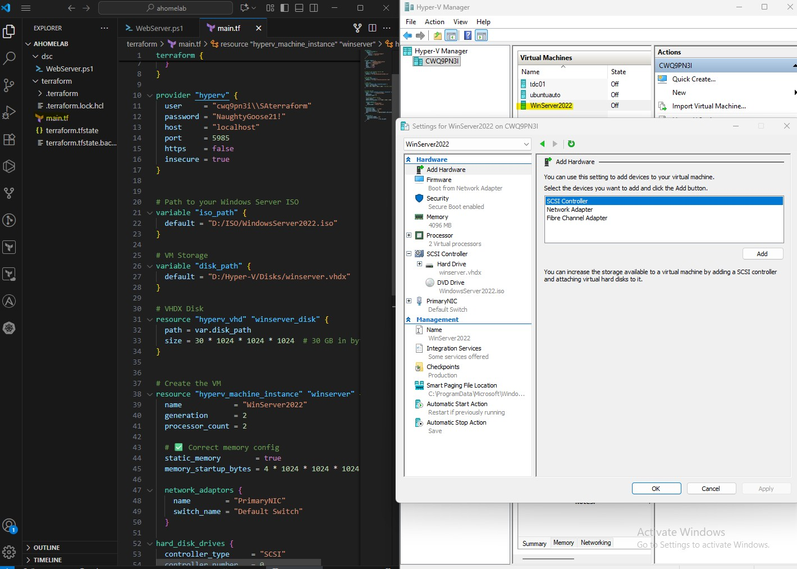

# Step 1: Terraform + Hyper-V Integration

## Prefatory Synopsis

Albeit Terraform Core does not natively support HyperV, an intermediate provider must facilitate commuincation, here we chose Taliesins due to the resource capabilities (vm's, VHD's, checkpoints etc).

Taliesins is an OpenSource project that relies on WinRM (Windows Remote Management: 5986) or HyperV API calls which can be problematic


## Environment
- Host machine: Windows 11 Pro
- Tools: Terraform v1.x, taliesins/hyperv provider
- VM target: Windows Server 2022 ISO
- Hyper V Enabled
- Git for windows installed for repo cloning and version control
- Install the following VScode extentions: HashiCorp Terraform, Powershell 7, Markdown, Github Integration

## Guide

1. Install core tooling

- Install VS code, then GIT + Terraform via Chocolatey
```powershell
 winget install Microsoft.VisualStudioCode
 choco install git
 choco install terraform
```


2. VS Code configuration

- Open VS code 
- On the left hand pane, select extentions and add the following: 
   - ms-vscode.powershell → PowerShell integration.
   - hashicorp.terraform → Terraform syntax + validation.
   - yzhang.markdown-all-in-one → Markdown preview + TOC.
   - GitHub.vscode-pull-request-github → GitHub integration.


3. GitHub repo clone and prep

- Clone your GitHub Repo locally via Powershell
  
  ```powershell
  cd [path you want to store root]
  git clone https://[hyperlink to repo]
  cd homelab-doc
  ```

- Then create a folder structure of your choice, I prefer to do it in PowerShell
   
   ```powershell
   mkdir docs
   mkdir docs\steps
   mkdir docs\troubleshooting
   mkdir docs\images
   ```


4. Configure your Terraform template (further details on this later or in its own doc) but this was the template I used for HyperV

```hcl 
terraform {
  required_providers {
    hyperv = {
      source  = "taliesins/hyperv"
      version = ">=0.4.0"
    }
  }
}

provider "hyperv" {
  user     = "cwq9pn3i/SAterraform"
  password = "CHANGEME"
  host     = "localhost"
  port     = 5985
  https    = false
  insecure = true
}

variable "iso_path" {
  default = "D:/ISO/WindowsServer2022.iso"
}

variable "disk_path" {
  default = "D:/Hyper-V/Disks/winserver.vhdx"
}

resource "hyperv_vhd" "winserver_disk" {
  path = var.disk_path
  size = 32212254720 # 30 GB in bytes
}

resource "hyperv_machine_instance" "winserver" {
  name            = "WinServer2022"
  generation      = 2
  processor_count = 2
  static_memory   = true
  memory_startup_bytes = 4 * 1024 * 1024 * 1024

  network_adaptors {
    name        = "PrimaryNIC"
    switch_name = "Default Switch"
  }

  hard_disk_drives {
    controller_type     = "SCSI"
    controller_number   = 0
    controller_location = 0
    path                = hyperv_vhd.winserver_disk.path
  }

  dvd_drives {
    controller_number   = 0
    controller_location = 1
    path                = var.iso_path
  }
}
```

5. Init + apply Terraform

 - Run the following commands in order within your VScode terminal
   
   ```powershell
   terraform init
   terraform plan
   terraform apply -auto-approve
   ```

## ✅ Successes
- Terraform initialized successfully.
- VHD created successfully.
- VM appeared in Hyper-V Manager.
- GitHub Repo set up for docs-as-code

## ⚠️ Hurdles
- WinRM authentication issues (401 errors).
  - Fixed with the following commands
  - winrm set winrm/config/service/auth @{Basic="true"}
  - winrm set winrm/config/service @{AllowUnencrypted="true"}
- Needed to enable Basic + AllowUnencrypted traffic.


## 📸 Screenshot


## 📌 Lessons Learned
- WinRM configs are critical for Hyper-V provider.


## 🔮 Next Steps
- Use DSC for VM configuration.
- Automate multiple VM builds with Terraform (DCs, FileServers ETC).
